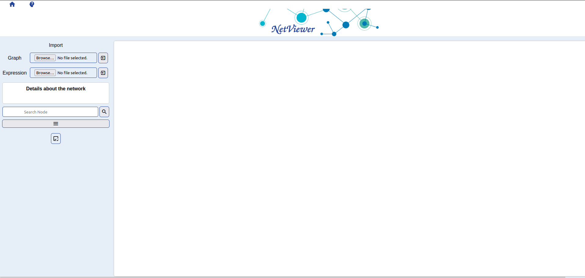
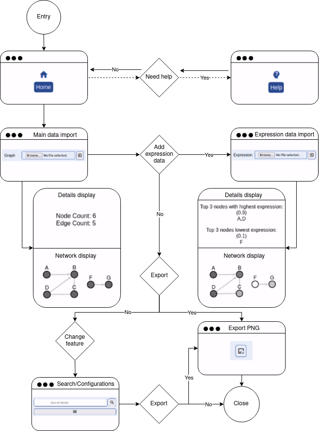

<p align="center"> </p>

# Documentation
This repository presents the code of Master's dissertation in Bioinformatics, to be presented in 2024, at University of Minho, entitled: 
**Web application for visualizing molecular interaction networks based on Cytoscape.js**.

## Context
This project presents a lightweight web-based visualization tool, called **NetViewer**,  designed to simplify the analysis of biomolecular interactions. The web app leverages Cytoscape.js to create and style networks based on gene expression data, offering an intuitive, browser-accessible alternative to desktop application Cytoscape. With this tool, users can upload network and expression data in CSV format, visualize biological networks, and apply various styling and layout options to enhance analysis. The application is designed for ease of use, feedback on incorrect file formats, and efficient client-side performance, making it an ideal solution for smaller-scale projects or preliminary data exploration.

## Usage
To access web app localy, fork and clone this repository. Afterwards, execute:

```
npm install
node app.js
```

This repository contains 4 example files inside folder <I>file_examples</I> that can be tested out or serve as reference. Two of them are the same as used in the DEMO slide of the Help page and in here below: one.csv and one-exp.csv, where the second is the expression data. This folder also contains extra two files (zero.csv and zero-exp.csv) that are other two examples, just with more data.

### NetViewer overview
NetViewer contains three pages: Home, Help and 'Not found'.

**Home**



### Workflow



### DEMO

<video width="1000" controls>
  <source src="public/src/howto.webm" type="video/webm">
</video>


## Contribution
Feel free to contribute to this project. After forking and cloning, you may:

```
git remote add upstream <original-repo-url>
```

And create a new branch. This way, whenever you push your changes, you may create a merge request to the source code, which is the present repository.
